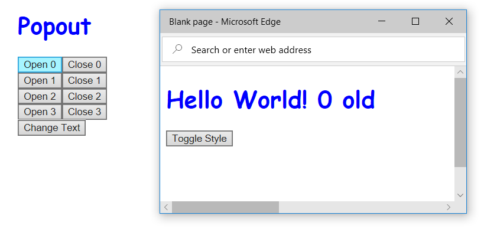

# React Popout Component

[](https://travis-ci.org/Microsoft/react-popout-component) [](https://www.npmjs.com/package/react-popout-component)

This is a React component designed for React 16 with complete Typescript support.



## Features

1. This is developed along side with the React 16 fix to allow mounting across frames *even for Edge and IE* browsers
2. Typescript support for all the options (especially hard to remember window features)
3. Reflects style-loader injected styles from the main window to the children window

## Installation

```sh
npm install react-popout-component
```

or

```sh
yarn add react-popout-component
```

## Usage

```tsx
import * as React from 'react';
import {Popout} from 'react-popout-component';

export default class App extends React.Component<any, any> {
    constructor(props: any) {
        super(props);
        this.state = {showPopout: false};
    }

    onClick = () => {
        this.setState({showPopout: true});
    }

    render() {
        return (
            <div>
                <h1>Now you too have the power to POP OUT</h1>
                <button onClick={this.onClick}>POP IT OUT!</button>
                {this.state.showPopout && (
                    <Popout>
                        <div>You can put anything here!</div>
                    </Popout>
                )}
            </div>
        );
    }
}

```

## API

PopOut Component has the following props:

```ts
export interface PopoutProps {
    hidden?: boolean;
    name?: string;
    onClose?: () => void;
    onBeforeUnload?: (evt: BeforeUnloadEvent) => string | null | undefined;
    children?: any;
    options?: Partial<WindowFeaturesOptions>;
    html?: string;
}
```

The `options` prop is of the following type:

```ts
export interface WindowFeaturesOptions {
    left: number;
    top: number;
    height: number;
    width: number;
    menubar: boolean;
    toolbar: boolean;
    location: boolean;
    status: boolean;
    resizable: boolean;
    scrollbars: boolean;
}
```

## Injection Mode

This component works well for both modes of style loading:
1. Appending Style blocks (e.g. style-loader)
2. Manual insertRule() into a CSSStyleSheet

For the second case with insertRule(), since there is nothing that can observe the insert event, a callback must be registered when a
rule is inserted. For an example usage with the Microsoft [Office Fabric](https://github.com/officedev/office-ui-fabric-react), 
set it up as a global like so:

```js
import {insertPopoutStylesheetRule} from 'react-popout-component';

window.FabricConfig = {
    mergeStyles: {
        onInsertRule: insertPopoutStylesheetRule
    }
}
```

## Contributing

This project welcomes contributions and suggestions.  Most contributions require you to agree to a
Contributor License Agreement (CLA) declaring that you have the right to, and actually do, grant us
the rights to use your contribution. For details, visit https://cla.microsoft.com.

When you submit a pull request, a CLA-bot will automatically determine whether you need to provide
a CLA and decorate the PR appropriately (e.g., label, comment). Simply follow the instructions
provided by the bot. You will only need to do this once across all repos using our CLA.

This project has adopted the [Microsoft Open Source Code of Conduct](https://opensource.microsoft.com/codeofconduct/).
For more information see the [Code of Conduct FAQ](https://opensource.microsoft.com/codeofconduct/faq/) or
contact [opencode@microsoft.com](mailto:opencode@microsoft.com) with any additional questions or comments.
